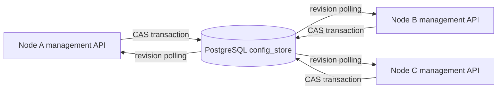

## Overview

This fork of Bifrost OSS supports active-active multinode deployments with a shared PostgreSQL `config_store`. Every node can serve inference traffic and accept configuration changes. PostgreSQL is the authoritative runtime configuration source, while each node keeps a local in-memory snapshot for fast request processing.

Configuration changes made through the Web UI or management API are committed with a global revision. Other nodes poll that revision and apply the latest database snapshot without requiring a restart.

<Warning>
  This multinode configuration synchronization is a fork-specific extension. It is not part of the upstream Bifrost OSS release and should not be interpreted as an upstream-supported capability.
</Warning>

<Info>
  The nodes are peers. There is no permanent leader, writer node, or follower role.
</Info>

## Supported synchronization

The fork synchronization layer covers configuration definitions that affect the gateway runtime:

- Providers and provider keys
- Client, authentication, proxy, and header-filter configuration
- Governance entities and routing rules
- Plugins
- MCP client definitions and virtual-key assignments
- Feature flags
- Prompt and skill definitions
- Framework and model-catalog synchronization settings

The following data remains operational state and does not increment the configuration revision:

- Budget and rate-limit usage counters
- Provider and key health status
- OAuth tokens, sessions, temporary tokens, and per-user credentials
- Background jobs and remote catalog synchronization state

<Warning>
  This fork's configuration synchronization does not provide cluster-wide, strongly consistent budget or rate-limit accounting. Each node still tracks request usage locally. Upstream Enterprise clustering remains the appropriate option when global usage enforcement and real-time distributed runtime state are required.
</Warning>

Some process-level settings still require a restart, including listener/TLS configuration, the `config_store` connection itself, and storage backend replacement.

---

## How synchronization works



1. A configuration mutation includes the revision that the caller last read.
2. PostgreSQL commits the configuration rows and increments the global revision in one transaction.
3. A stale mutation is rejected with `409 Conflict` instead of silently overwriting another administrator's change.
4. The node that accepted the write applies the committed configuration locally.
5. Other nodes detect the new revision within the polling interval and reconcile directly to the latest snapshot.
6. A node becomes ready only after its initial database snapshot is loaded and validated.

Nodes can skip intermediate revisions after downtime because synchronization is state-based. They read and apply the latest committed snapshot rather than replaying every historical mutation.

---

## Configure PostgreSQL as the authority

All nodes must use `source_of_truth: "config_store"` and connect to the same PostgreSQL database.

```json
{
  "$schema": "https://www.getbifrost.ai/schema",
  "source_of_truth": "config_store",
  "encryption_key": "env.BIFROST_ENCRYPTION_KEY",
  "config_store": {
    "enabled": true,
    "type": "postgres",
    "config": {
      "host": "env.PG_HOST",
      "port": "5432",
      "user": "env.PG_USER",
      "password": "env.PG_PASSWORD",
      "db_name": "bifrost",
      "ssl_mode": "require"
    }
  },
  "logs_store": {
    "enabled": true,
    "type": "postgres",
    "config": {
      "host": "env.PG_HOST",
      "port": "5432",
      "user": "env.PG_USER",
      "password": "env.PG_PASSWORD",
      "db_name": "bifrost_logs",
      "ssl_mode": "require"
    }
  }
}
```

When `source_of_truth` is `config_store`:

- `config.json` is bootstrap-only.
- Runtime sections such as `providers`, `governance`, `plugins`, and `mcp` are ignored in the file.
- Provider environment auto-detection is disabled.
- PostgreSQL is required; SQLite is rejected.

Every node must use the same encryption key. Nodes must also have the same Bifrost version and access to the same custom plugin binaries.

---

## Helm deployment

Set the chart to use PostgreSQL and the database-authoritative source mode:

```yaml
replicaCount: 3

bifrost:
  sourceOfTruth: config_store
  encryptionKeySecret:
    name: bifrost-encryption
    key: encryption-key

storage:
  mode: postgres
  configStore:
    enabled: true
    type: postgres
  logsStore:
    enabled: true
    type: postgres

postgresql:
  external:
    enabled: true
    host: postgres.example.internal
    port: "5432"
    database: bifrost
    user: bifrost
    existingSecret: bifrost-postgres
    passwordKey: password
```

The chart uses separate probes:

- `GET /health` for liveness and backing-store health
- `GET /ready` for traffic readiness after the initial configuration snapshot is applied

<Note>
  Keep the readiness probe on `/ready`. Using `/health` can route traffic to a newly started node before its provider, governance, plugin, and MCP state is available.
</Note>

---

## Configuration revision API

The Bifrost Web UI manages revisions automatically. Direct API clients should read the current revision before sending a configuration mutation.

```bash
curl -i http://localhost:8080/api/config/revision
```

Example response:

```http
HTTP/1.1 200 OK
ETag: "42"
X-Bifrost-Config-Revision: 42
Content-Type: application/json
```

```json
{
  "revision": 42
}
```

Pass the revision through `If-Match`:

```bash
curl -X POST http://localhost:8080/api/providers \
  -H "Content-Type: application/json" \
  -H "If-Match: 42" \
  -d '{
    "provider": "openai"
  }'
```

Successful mutations return the new revision in `ETag` and `X-Bifrost-Config-Revision`.

| Status | Meaning |
|---|---|
| `200` / `201` | Database commit and local runtime apply succeeded |
| `202` | Database commit succeeded, but local runtime apply is pending and will be retried |
| `409` | The supplied revision is stale; fetch the latest state before retrying |
| `428` | `If-Match` was not supplied for a synchronized configuration mutation |

Do not automatically replay a `409` response with a new revision. Refresh the affected configuration first so an administrator can resolve the concurrent change.

---

## Operational requirements

### Load balancing

Place a load balancer or Kubernetes Service in front of all nodes. Every ready node can serve inference and management traffic.

### PostgreSQL availability

The gateway continues serving with its last successfully applied in-memory snapshot during a temporary polling failure. Configuration writes and new-node startup require PostgreSQL availability.

### Startup coordination

Nodes coordinate initial database hydration with a renewable distributed lock. This prevents simultaneous empty-database initialization from overwriting singleton or seed configuration.

### Monitoring

Monitor these signals:

- `/ready` failures during startup
- Configuration revision conflicts (`409`)
- Committed-but-pending responses (`202`)
- Config sync worker errors or repeated reconcile failures
- PostgreSQL connection health and latency

---

## Static-file alternative

A shared static `config.json` with `config_store.enabled: false` remains supported. This approach is useful for fully declarative deployments where every configuration change already triggers a rolling restart.

Use PostgreSQL `config_store` synchronization when operators need to manage providers, keys, routing, plugins, or MCP clients through the Web UI or API without restarting every gateway node.

---

## Fork and Enterprise comparison

| Capability | Fork OSS PostgreSQL sync | Upstream Enterprise clustering |
|---|---|---|
| Gateway topology | Active-active peers | Active-active peers |
| Configuration persistence | PostgreSQL | PostgreSQL |
| Configuration propagation | Revision polling and snapshot reconciliation | Real-time cluster synchronization |
| Concurrent writes | Global revision CAS | Cluster-coordinated writes |
| Global budget/rate-limit usage | Not provided | Supported |
| Runtime operational-state synchronization | Limited to configuration definitions | Supported |

See [Enterprise Clustering](/enterprise/clustering) when the deployment requires globally coordinated usage, traffic distribution, or operational runtime state.
